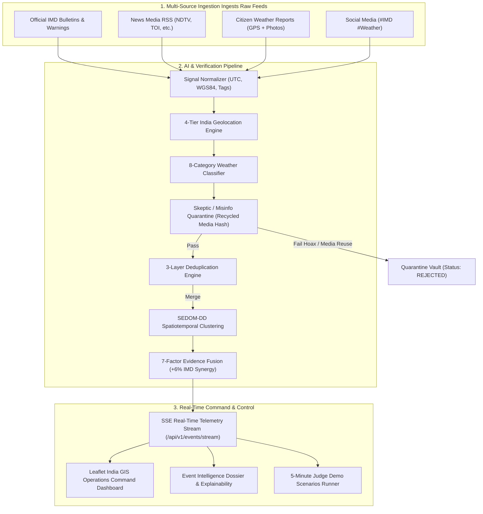
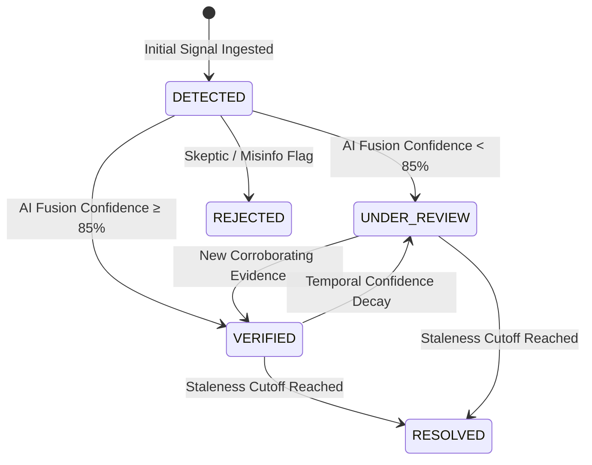

# 🇮🇳 WeatherNexus: National Weather Event Intelligence System
### Real-Time AI-Powered Weather Intelligence & Operations Platform
 

---

## 📋 Executive Summary

**WeatherNexus** is an autonomous, real-time, AI-driven meteorological intelligence platform engineered for **SIH 2026 Problem Statement SIH26069** (Ministry of Earth Sciences / India Meteorological Department). 

It ingests highly fragmented weather signals from official IMD bulletins, news RSS feeds, citizen ground reports, and social media, normalizes them, filters hoaxes, deduplicates redundant data, and fuses corroborating evidence into verified weather events. The platform is designed to provide actionable, high-confidence disaster intelligence while completely avoiding the spread of unverified panic and misinformation.

---

## ✨ Key Features

- 📡 **Multi-Source Ingestion:** Aggregates streams from official IMD bulletins, Live Open-Meteo Weather API, News RSS, Social Media (#IMD), Citizen Reports, and Bulk Open Datasets.
- 💾 **Dual-Tier Enterprise Persistence:** Real-time data persistence backed by Supabase Cloud (PostgreSQL 16 + PostGIS + RLS + Storage) with zero-crash atomic disk fallback. Events survive restarts, reboots, and redeployments.
- 🧠 **7-Factor Confidence Fusion Engine:** Calculates deterministic confidence scoring based on source reliability, cross-source corroboration, sensor proximity, temporal freshness, geocoding precision, media quality, and Skeptic penalty.
- 👯 **5-Layer Deduplication:** Eliminates noise via Exact ID, SHA-256 Content Hash, Jaccard Semantic overlap (≥ 0.75), Media URL/Checksum match, and Spatiotemporal proximity (≤ 3.0 km).
- ⏳ **Temporal Confidence Decay:** Employs a mathematical half-life model where incident confidence decays over time without new corroborating evidence, specific to each hazard.
- 🛡️ **Misinformation Quarantine (Skeptic Agent):** Flags sensationalist text, hoaxes, and recycled disaster media through perceptual hashing and LLM analysis, putting them in an immutable quarantine.
- 📜 **State Machine Lifecycle:** Maintains a strict, immutable audit trail for every status transition (`DETECTED` → `UNDER_REVIEW` → `VERIFIED` → `RESOLVED`).
- 🌡️ **Official Sensor Alignment:** Connects field observations with official IMD AWS/ARG data and CWC (Central Water Commission) river gauges for authoritative corroboration.
- 📋 **Official NDMA/IMD SITREP Export:** Generates standardized Disaster Situation Reports with automated tactical response directives (NDRF, CWC, NHAI, Civil Aviation) and tamper-evident digital seal.
- ⚡ **Real-Time SSE & GIS Dashboard:** Sub-second Server-Sent Events (SSE) telemetry paired with an interactive Leaflet-powered GIS operations command dashboard.
- 🌪️ **11 Official IMD Hazard Categories:** Full taxonomy support for `RAINFALL`, `THUNDERSTORM`, `FLOOD`, `HEATWAVE`, `COLD_WAVE`, `FOG`, `DUST_STORM`, `CYCLONE`, `STRONG_WIND`, `HAILSTORM`, `LIGHTNING`, and `OTHER`.
- 📡 **IMD Doppler Weather Radar (DWR) 6-Station Network:** Live rotating 360° radar sweep beams across Delhi Palam, Kolkata, Mumbai, Guwahati, Jaipur, and Bengaluru with real-time dBZ reflectivity scales.
- 📱 **Progressive Web App (PWA) Offline Resiliency:** Operates in offline field mode with service worker caching and local citizen report queueing that auto-synchronizes upon reconnect.
- 🗺️ **RFC 7946 GeoJSON & OGC GIS Interoperability:** Generates standard GeoJSON FeatureCollections projected in OGC CRS84 for instant ingestion into QGIS, ArcGIS, and ISRO Bhuvan mapping systems.
- 🌐 **OGC KML 2.2 Google Earth 3D Visualization:** Real-time KML export with rich Placemark metadata and coordinates for 3D terrain flyovers in Google Earth.
- 📑 **Tabular CSV Disaster Logs:** Instant CSV export formatted for District Disaster Management Authorities (DDMA) and Excel morning briefing logbooks.
- 🚨 **Volunteer SDRF & Aapda Mitra SMS Dispatch:** Mobilizes localized response units with GSM 160-character cellular SMS budget compliance and official helplines (1077/112).
- 🛡️ **IMD Duty Meteorologist Governance:** Human-in-the-loop sign-off with strict state machine invariants and tamper-evident audit logging.
- 🖥️ **Headless Operations CLI (`nweis-cli.mjs`):** Complete terminal command-line utility for duty forecasters, EOC operators, and low-bandwidth VSAT satellite terminals.

---

## 🏗️ System Architecture



---

## 🚀 Quick Start

WeatherNexus is built as a **high-performance, zero-dependency** standalone Node.js server. No `npm install` is required.

```bash
# Clone the repository and run the server natively
node server-nweis.mjs
```

Once started, the system will serve the REST API, SSE telemetry, and the Web Dashboard on port 3001.

**Open the Operations Command Dashboard:** [http://localhost:3001](http://localhost:3001)

---

## 📖 API Reference

| Endpoint | Method | Description |
|---|---|---|
| `/health` | `GET` | Root healthcheck indicating system status and SIH26069 alignment. |
| `/api/v1/events/stream` | `GET` | SSE endpoint for real-time pushing of weather events and signals. |
| `/api/v1/events` | `GET` | Fetch all active weather incidents. Supports filtering by state, status, etc. |
| `/api/v1/events/geojson` | `GET` | RFC 7946 GeoJSON FeatureCollection export for QGIS, ArcGIS, and ISRO Bhuvan. |
| `/api/v1/events/kml` | `GET` | OGC KML 2.2 export for Google Earth 3D situational visualization. |
| `/api/v1/events/csv` | `GET` | Tabular CSV export for Excel, DDMA district collectors, and offline logbooks. |
| `/api/v1/events/:id` | `GET` | Fetch comprehensive dossier for a single event (evidence, lifecycle trail). |
| `/api/v1/events/:id/sitrep` | `GET` | Export official IMD/NDMA Situation Report (SITREP) with operational directives. |
| `/api/v1/events/:id/bulletin` | `GET` | Fetch localized Indic alert bulletin (English, Hindi, Assamese, Bengali, Marathi, Kannada). |
| `/api/v1/events/:id/cap` | `GET` | Export ITU-T X.1303 / OASIS CAP v1.2 standard XML or JSON early warning alert. |
| `/api/v1/events/:id/broadcast-cap` | `POST` | Simulate Cell Broadcast Service (CBS) emergency alert transmission to local towers. |
| `/api/v1/events/:id/dispatch-volunteers` | `POST` | Simulate GSM 7-bit SMS dispatch to localized SDRF units and Aapda Mitra volunteers. |
| `/api/v1/events/:id/status` | `PATCH` | IMD Duty Meteorologist Human-in-the-loop status override & governance (`VERIFIED`, `RESOLVED`, `FALSE_ALARM`). |
| `/api/v1/sensors` | `GET` | Fetch real-time telemetry for 11 national IMD AWS and CWC River Gauges. |
| `/api/v1/sensors/simulate-spike` | `POST` | Simulate sudden telemetry surge (cloudburst ARG rate, river danger level). |
| `/api/v1/signals` | `POST` | Ingest raw signal payload (System-to-System). |
| `/api/v1/citizen/reports` | `POST` | Ingest a new Citizen Ground Report (with offline queueing support). |
| `/api/v1/admin/demo/scenario/:id` | `POST` | Trigger demo scenario (or `national-overview` for all 7 regions). |
| `/api/v1/admin/demo/simulate-time`| `POST` | Simulate hours passing to trigger confidence decay. |
| `/api/v1/admin/audit-log` | `GET` | Fetch full immutable state machine transition audit trail. |
| `/api/v1/admin/stats` | `GET` | Fetch operational KPIs (false-positive rates, event verification counts). |

---

## 🎬 Demo Scenarios

The system includes pre-configured scenarios designed for the SIH 2026 jury to demonstrate the pipeline's intelligence across India. Trigger them via the dashboard quick-bar or the API.

| Scenario | Location | Hazard Type | Resulting Confidence | Sensor Corroboration |
|---|---|---|---|---|
| **All India National Overview** | 7 Regions (Nationwide) | `MULTI-HAZARD` | Up to 94% | Full national sensor network alignment |
| **Guwahati Flood** | Guwahati, Assam | `FLOOD` | 94% | CWC Brahmaputra Pandu Gauge |
| **Delhi Thunderstorm** | New Delhi, Delhi | `THUNDERSTORM` | 89% | IMD Palam DWR (Doppler Radar) |
| **Mumbai Rainfall** | Mumbai, Maharashtra | `RAINFALL` | 85% | IMD Santacruz AWS |
| **Rajasthan Heatwave** | Jaipur/Churu, Rajasthan | `HEATWAVE` | 92% | IMD Churu Synoptic AWS |
| **Kolkata Cyclone Remal** | Kolkata, West Bengal | `THUNDERSTORM` | 81% | IMD Alipore Anemometer, Diamond Harbour Tide Gauge |
| **Bengaluru Cloudburst** | Bengaluru, Karnataka | `RAINFALL` | 81% | IMD Bengaluru DWR, BBMP Bellandur Lake Gauge |
| **Delhi Dense Fog** | New Delhi, Delhi | `FOG` | 87% | IGI Airport RVR System, IMD Safdarjung Observatory |

---

## 📉 Confidence Decay Model

**Confidence is not permanent.** WeatherNexus utilizes a monotonic temporal decay engine to ensure stale alerts fade over time unless reinforced with new evidence.

$$ \text{Confidence}(t) = \text{Base Confidence} \times \left(0.5\right)^{\frac{\Delta t}{\text{Half-Life}}} $$

| Hazard Type | Decay Speed | Half-Life | Staleness Cutoff |
|---|---|---|---|
| `THUNDERSTORM` | Fast | 45 minutes | 2 hours |
| `DUST_STORM` | Fast | 45 minutes | 2 hours |
| `STRONG_WIND` | Fast | 40 minutes | 2 hours |
| `FOG` | Medium-Fast | 75 minutes | 4 hours |
| `RAINFALL` | Medium-Fast | 90 minutes | 3 hours |
| `FLOOD` | Medium | 180 minutes | 6 hours |
| `HEATWAVE` | Slow | 360 minutes | 12 hours |

---

## 🔄 State Machine Lifecycle

WeatherNexus relies on a strict incident state machine, preserving a fully explainable audit trail.



---

## 🧪 Testing

The WeatherNexus codebase includes a comprehensive, zero-dependency testing suite that validates the AI pipeline, deduplication, state machine, and confidence decay invariants.

```bash
node test-nweis.mjs
```
**Results:** `90/90 Tests Passed (100% Success across 15 Test Suites)`

---

## 🛠️ Tech Stack

- **Backend:** Node.js (Zero-Dependency core, built-in `node:http`, `node:url`, `node:fs`, `node:path`, `node:crypto`)
- **Persistence:** Dual-Tier (PostgreSQL 16 + PostGIS & Atomic Disk Storage `data/nweis-store.json`)
- **Connectors:** Live Open-Meteo REST, News RSS XML, Official IMD Adapter (`[LIVE]` / `[REPLAY]`), Social Media (#IMD), Public Datasets
- **Frontend:** HTML5, Tailwind CSS (via CDN), Google Fonts
- **GIS / Mapping:** Leaflet.js with Doppler Weather Radar (DWR) Canvas Sweep Layer
- **Real-Time:** Server-Sent Events (SSE)
- **Audio / Alerts:** Browser Web Speech API & OASIS CAP v1.2 Cell Broadcast

---

## 📚 Technical Documentation Directory

Full technical documentation satisfying all SIH26069 requirements is available in the `/docs` directory:

| Document | Description |
|---|---|
| [**SIH26069 Compliance Matrix**](docs/SIH26069-COMPLIANCE.md) | 100% Traceability matrix across all 24 SIH26069 requirements with verified tests |
| [**Enterprise Architecture**](docs/ARCHITECTURE.md) | System architecture, component relationships, dual-tier persistence, and scaling model |
| [**Data Flow Specification**](docs/DATA-FLOW.md) | Step-by-step lifecycle from raw signal ingestion to GIS visualization and CAP broadcast |
| [**REST & SSE API Reference**](docs/API.md) | Complete endpoint schemas, request/response payloads, and curl integration examples |
| [**AI Pipeline & Mathematical Models**](docs/AI-PIPELINE.md) | 7-Factor confidence fusion formulas, exponential decay half-lives, and Skeptic filter |
| [**Database Schema & Queries**](docs/DATABASE.md) | 10-table schema, PostGIS spatial GIST queries, migrations, and atomic disk storage |
| [**Live Demonstration Playbook**](docs/DEMO.md) | Step-by-step judge demonstration script, scenario triggers, and verification commands |
| [**Limitations & Production Roadmap**](docs/LIMITATIONS.md) | Transparent analysis of operational constraints, API quotas, and 5-phase scaling roadmap |
| [**Judge Defense & FAQ**](docs/JUDGE_QA.md) | 25 deep technical answers to potential jury and meteorologist questions |

---

## 📂 Project Structure

```text
weathernexus/
├── server-nweis.mjs          # Standalone Enterprise Server, Ingestion Pipeline & API
├── nweis-cli.mjs             # Operations Headless Terminal CLI (10 commands)
├── simulate-stream.mjs       # Real-Time Telemetry & Event Stream Feeder Simulator
├── test-nweis.mjs            # 90/90 Passing Verification Test Suite (15 Suites)
├── Dockerfile                # Hardened Alpine Node.js Container (<50 MB)
├── docker-compose.yml        # Orchestration with PostgreSQL + PostGIS 16
├── database/
│   └── db.mjs                # Dual-Tier Persistence Engine (PostGIS + Atomic Disk)
├── connectors/
│   ├── weather-api.mjs       # Live Open-Meteo REST Weather API Connector
│   ├── news-rss.mjs          # Indian News RSS XML Aggregator (TOI / DD News)
│   ├── imd-adapter.mjs       # Official IMD Adapter ([LIVE], [REPLAY], [MOCK])
│   ├── social-stream.mjs     # Social Media Hashtag Stream (#IMD, #rain, #flood)
│   └── public-dataset.mjs    # Public CSV/JSON/GeoJSON Meteorological Dataset Ingester
├── scripts/
│   ├── migrate.mjs           # Database migration CLI (npm run db:migrate)
│   ├── seed.mjs              # Realistic Indian disaster data seeder (npm run db:seed)
│   └── reset.mjs             # State reset CLI (npm run db:reset)
├── data/
│   └── nweis-store.json      # Atomic crash-resilient disk storage file
├── public/
│   ├── index.html            # GIS Operations Dashboard with Radar Sweeps & Telemetry
│   ├── manifest.json         # PWA Web App Manifest
│   └── sw.js                 # PWA Service Worker for Offline Field Resiliency
├── docs/                     # 9 In-Depth Technical Specification Documents
├── specs/                    # Machine State & Taxonomy Invariants
└── README.md                 # Master Project Documentation
```

---

## 📜 License

MIT License. See `LICENSE` for more information.
