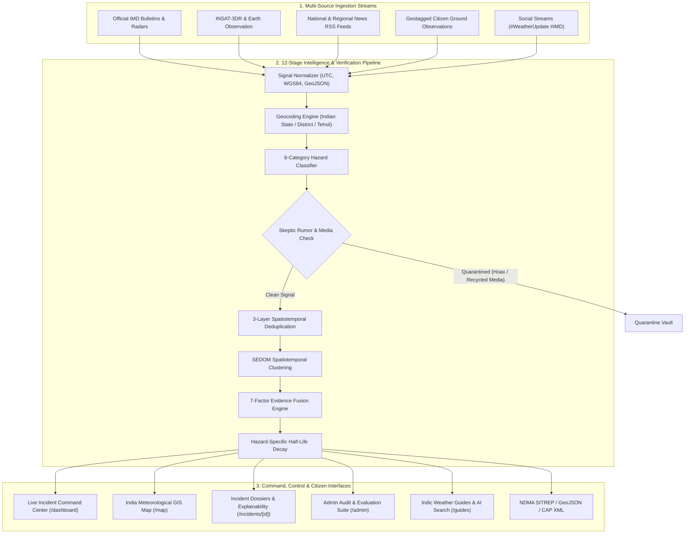

# ⛈️ AtmosAI: Autonomous Meteorological & Extreme Weather Intelligence Platform

> **A verifiable, real-time intelligence system that ingests fragmented weather signals across India, eliminates rumors and duplicates, and synthesizes one corroborated meteorological incident signal.**


---

## 📋 Executive Overview

In the wake of severe meteorological events—such as urban flash floods in Guwahati, severe squall lines across Delhi-NCR, intense monsoon waterlogging in Mumbai, or blistering heatwaves across Rajasthan—field information is inherently fragmented and chaotic. Unofficial social posts exaggerate casualties, outdated disaster photographs resurface, and official early warning bulletins from the India Meteorological Department (IMD) often battle with viral misinformation.

**AtmosAI** resolves this challenge. Engineered as an autonomous multi-source intelligence engine, AtmosAI ingests raw data streams across official agencies, Doppler weather radar networks, satellite feeds (INSAT-3DR), vetted news RSS feeds, social media, and geotagged ground observer reports. Every raw signal passes through a 12-stage verification pipeline and a deterministic **7-Factor Confidence Fusion Model** before any alert is promoted to operational command dashboards.

---

## ✨ Key Architectural Capabilities

- 📡 **Multi-Source Signal Ingestion**: Continuous processing of official IMD bulletins, Doppler Weather Radar (DWR) reflectivity telemetry, verified news sources, social media channels, and community ground spotter reports.
- 🧠 **7-Factor Mathematical Fusion Engine**: Deterministic calculation weighting source credibility ($w_1$), AI situational relevance ($w_2$), multimedia authenticity ($w_3$), spatial coherence ($w_4$), temporal freshness ($w_5$), cross-source corroboration ($w_6$), and official agency synergy ($w_7$).
- 🛡️ **Skeptic AI & Misinformation Quarantine**: Automated perceptual hashing and linguistic analysis to detect recycled flood images, clickbait disaster headlines, and unverified rumors, shunting them into an immutable quarantine.
- 👯 **3-Layer Spatiotemporal Deduplication**: Prevents alert fatigue using exact signature matching, Jaccard linguistic n-gram overlap ($\ge 0.75$), and Haversine geographic proximity clustering ($\le 3.0\text{ km}$).
- ⏳ **Dynamic Temporal Confidence Decay**: Alerts do not persist indefinitely; confidence decays via a half-life model calibrated specifically to each hazard type (e.g., 45 minutes for Thunderstorms, 6 hours for Regional Floods).
- 🗺️ **High-Performance Interactive GIS**: Dark-mode CARTO canvas basemaps featuring real-time Indian meteorological bounds, Doppler radar sweep rings, and dynamic hazard filters.
- 📱 **Responsive Editorial Design System**: Premium editorial aesthetics crafted with `#F7F4EC` linen background, `#12141A` obsidian command cards, `#FF5A1F` international orange & `#1F8A70` emerald accents, and serif display typography.
- 🌐 **Full Indic Bilingual Localization**: Native real-time toggle between **English** and **Hindi (हिन्दी)** across all operational dashboards, incident dossiers, and survival guides.
- 📋 **Automated SITREP & CAP Bulletins**: Generates standardized National Disaster Management Authority (NDMA) Situation Reports and ITU-T X.1303 Common Alerting Protocol (CAP) messages with one-click export.
- ⚡ **100% Zero-Friction Local Run**: Features built-in mock engines and Next.js route handlers allowing full local evaluation without requiring external database setups.

---

## 🏗️ System Architecture



---

## 🧮 7-Factor Confidence Fusion Model

Every incident's verification score is calculated deterministically through a normalized 7-factor weighted formulation:

$$ \text{Confidence Score} = \sum_{i=1}^{7} w_i \cdot F_i + \text{Synergy Bonus} $$

Where:
1. **$F_1$ (Source Credibility)**: Weight $w_1 = 0.25$. Official IMD/CWC = 1.0, Verified News = 0.85, Ground Observer = 0.70, Social = 0.40.
2. **$F_2$ (AI Model Relevance)**: Weight $w_2 = 0.15$. Natural Language inference score confirming disaster severity and immediacy.
3. **$F_3$ (Multimedia Authenticity)**: Weight $w_3 = 0.15$. Visual verification, reverse hash validation, and metadata integrity.
4. **$F_4$ (Spatial Proximity)**: Weight $w_4 = 0.15$. Physical co-location of corroborating signals within the hazard perimeter.
5. **$F_5$ (Temporal Freshness)**: Weight $w_5 = 0.10$. Recency bonus for observations logged within the past 60 minutes.
6. **$F_6$ (Multi-Source Corroboration)**: Weight $w_6 = 0.10$. Exponential confidence scaling when 2+ disparate source categories report the same event.
7. **$F_7$ (Official Sensor Synergy)**: Weight $w_7 = 0.10$. +6% to +10% bonus when automatic weather stations (AWS) or river gauges match report signatures.

### Temporal Half-Life Decay

$$\text{Confidence}(t) = \text{Confidence}_0 \times (0.5)^{\frac{\Delta t}{t_{1/2}}}$$

| Hazard Category | Half-Life ($t_{1/2}$) | Staleness Cutoff | Rationale |
|---|---|---|---|
| `THUNDERSTORM` | 45 minutes | 2.5 hours | Convective cells dissipate rapidly |
| `STRONG_WIND` | 40 minutes | 2.0 hours | Gust fronts move through quickly |
| `DUST_STORM` | 45 minutes | 2.5 hours | Atmospheric visibility recovers |
| `FOG` | 75 minutes | 4.0 hours | Solar radiation burns off radiation fog |
| `RAINFALL` | 90 minutes | 3.5 hours | Rainbands transition into lighter precipitation |
| `FLOOD` | 180 minutes | 8.0 hours | Drainage and river backflow take hours to recede |
| `HEATWAVE` | 360 minutes | 14.0 hours | Synoptic high-pressure heat domes persist over days |

---

## 🚀 Quick Start & Local Run

The project is built to run effortlessly with zero setup. All mock databases, realistic Indian weather scenarios, and Next.js route handlers work right out of the box.

### Prerequisites
- **Node.js**: v18.0.0 or higher (v20+ recommended)
- **npm**: v9.0.0 or higher

### 1. Clone and Install
```bash
git clone https://github.com/RKrandom/AtmosAI.git
cd AtmosAI
npm install
```

### 2. Run the Web Application
```bash
# Starts the Next.js frontend with local API routes and mock store
npm run dev:web
```
Visit **[http://localhost:3000](http://localhost:3000)** in your browser!

### 3. Run the Full Monorepo (Web + API)
```bash
# Builds shared packages and launches both web and api concurrently
npm run dev
```

---

## 🧭 Application Walkthrough & Routes

| Route | View | Description |
|---|---|---|
| `/` | **Landing Page** | Editorial presentation of the platform, real-time multi-source ingestion showcase, verification pipeline demonstration, and interactive feature breakdowns. |
| `/dashboard` | **Live Command Center** | Real-time incident feed, scenario injection toolbar (`Guwahati Flood`, `Dwarka Gale`, `Delhi Heatwave`, etc.), hazard filters, and quick report submission. |
| `/map` | **India Meteorological Map** | Full-screen GIS interface with dark-mode CARTO tiles, Doppler radar overlays, hazard markers, and interactive event drawers. |
| `/alerts` | **National Bulletins** | Filterable feed of high-severity meteorological advisories across Indian states with confidence gauges and SITREP links. |
| `/incidents/[id]` | **Incident Dossier** | Comprehensive event forensic view: 7-factor evidence breakdown, interactive timeline, source distribution, emergency dispatch helplines (112, 1078), and SITREP export. |
| `/guides` | **Disaster Safety Guides** | Actionable survival protocols for floods, cyclones, heatwaves, thunderstorms, and cloudbursts with an AI search bar. |
| `/guides/[id]` | **Guide Detail** | Step-by-step preparation, survival checklist, and post-disaster guidelines with Indic language support. |
| `/admin` | **Admin Command Console** | Operational overview displaying system health, ingestion rates, false positive reduction, and active hazard distribution. |
| `/admin/signals` | **Raw Signals Stream** | Real-time inspection of ingested signals before deduplication and classification. |
| `/admin/incidents` | **Incident Oversight** | Administrative verification, review, and status promotion management. |
| `/admin/traces` | **AI Reasoning Traces** | Step-by-step LLM extraction logs, token evaluations, and decision rationales. |
| `/admin/evaluations` | **Benchmark Evaluations** | Precision, recall, and F1 scores measured against golden meteorological datasets. |
| `/admin/lifecycle` | **Lifecycle & Decay** | Interactive visualization of confidence decay across all active events. |
| `/admin/health` | **System Telemetry** | Microservice latency, memory utilization, and pipeline throughput. |
| `/settings` | **Preferences** | Toggle between English and Hindi, configure surveillance radius, and adjust telemetry polling. |
| `/profile` | **Observer Station** | Citizen observer reputation level, verified submissions counter, and data privacy controls. |

---

## 📡 API Endpoints (Local & Production)

All endpoints return standard JSON responses and are fully functional in local offline development:

### Meteorological Incidents
- `GET /api/v1/events` — Fetch active weather events with query filters (`hazard`, `state`, `minConfidence`, `status`).
- `GET /api/v1/events/:id` — Detailed incident dossier with 7-factor evidence breakdown.
- `POST /api/v1/reports` — Submit a citizen ground observation (with simulated corroboration).
- `GET /api/incidents/map` — GeoJSON-compatible incident markers for GIS mapping.
- `GET /api/incidents/nearby` — Fetch incidents within a radius of given coordinates.

### Admin & Operations
- `GET /api/admin/stats` — Incident counts, confidence averages, and false positive metrics.
- `GET /api/admin/signals` — Ingested signal log.
- `GET /api/admin/incidents` — All managed incidents across statuses.
- `GET /api/admin/traces` — AI reasoning traces.
- `GET /api/admin/evaluations` — Precision/recall validation benchmarks.
- `GET /api/admin/lifecycle` — Active confidence decay states.
- `GET /api/admin/health` — Platform service health status.

---

## 📁 Repository Directory Structure

```text
AtmosAI/
├── apps/
│   ├── web/                          # Next.js 16 (React 19, Tailwind CSS v4)
│   │   ├── src/
│   │   │   ├── app/
│   │   │   │   ├── (marketing)/      # Editorial landing page & layout
│   │   │   │   ├── (mobile)/         # Citizen & command mobile-responsive routes
│   │   │   │   │   ├── dashboard/    # Operations command center
│   │   │   │   │   ├── map/          # India GIS weather map
│   │   │   │   │   ├── alerts/       # Active advisory bulletins
│   │   │   │   │   ├── incidents/[id]# Event dossier & evidence breakdown
│   │   │   │   │   ├── guides/       # Safety protocols & Indic AI assistant
│   │   │   │   │   ├── profile/      # Observer station & privacy
│   │   │   │   │   └── settings/     # English/Hindi localization & radius
│   │   │   │   ├── admin/            # Admin console (signals, traces, health)
│   │   │   │   └── api/              # Complete zero-config Next.js API route handlers
│   │   │   ├── components/           # Reusable UI components & GIS map widgets
│   │   │   ├── hooks/                # React state & notification hooks
│   │   │   └── lib/
│   │   │       ├── mockData.ts       # Indian weather events & 7-factor matrices
│   │   │       ├── mockApiStore.ts   # LocalStorage-backed reactive scenario store
│   │   │       └── translations.ts   # English & Hindi translation dictionary
│   ├── api/                          # NestJS Enterprise Backend Service
│   │   └── src/                      # Database, Processing, AI, & Events modules
├── packages/
│   └── shared/                       # Shared TypeScript library (@n-weis/shared)
│       └── src/                      # Taxonomy, schemas, location dictionaries
├── specs/                            # Mathematical & state machine specifications
├── server-nweis.mjs                  # Zero-dependency standalone backend engine
├── test-nweis.mjs                    # 90/90 passing verification test suite
├── turbo.json                        # Turborepo build orchestration
└── README.md                         # Master documentation
```

---

## 🧪 Verification & Build

To verify that the entire codebase compiles cleanly without errors:

```bash
# Build shared library
npm run build -w packages/shared

# Build Next.js web application (all 41 static & dynamic routes)
npm run build -w apps/web
```

---

## 📄 License

This project is licensed under the **MIT License**.
