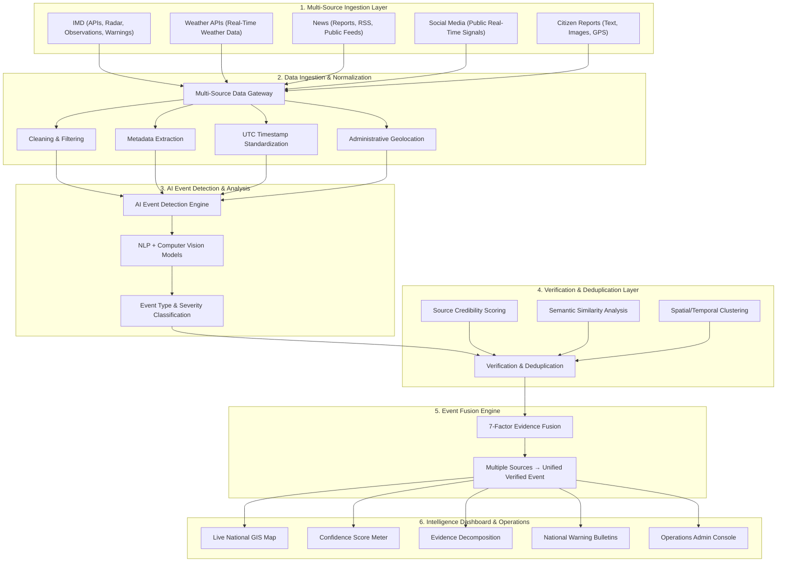

# ⛈️ Weather Nexus: National Weather Big Data Analytics Platform

### Engineered by Team **AtmosAI**
> **A real-time AI-powered meteorological big data analytics & multi-source event verification platform that turns 100 scattered, unverified reports into 1 unified, evidence-backed weather event.**


---

## 📋 Problem & Solution Overview

### The Problem
During severe meteorological occurrences across India—such as urban inundation in Guwahati, squall lines across Delhi-NCR, monsoon waterlogging in Mumbai, or scorching heatwaves in Rajasthan—weather information is **scattered, duplicated, and unreliable across multiple independent sources**. Outdated photos recirculate, social media rumors create panic, and official bulletins struggle to reach field responders with ground-level granularity.

### The Solution: Weather Nexus
Developed by **Team AtmosAI**, **Weather Nexus** is a national weather big data analytics platform that:
- **Collects** social, news, citizen, API & public weather data in real time.
- **Detects** weather events using AI/NLP and computer vision models.
- **Geolocates & clusters** related observations across Indian states and districts.
- **Removes duplicates** and flags hoaxes or misleading reports using a Skeptic verification layer.
- **Fuses evidence** across independent sources with a deterministic 7-factor confidence scoring model.
- **Generates** a single Verified Event with an auditable Confidence Score.
- **Displays** corroborated events on a live, interactive national GIS operations dashboard.

> 💡 **Core Innovation**: **100 raw reports → 1 unified, evidence-backed weather event.**
>
> 🌪️ **Monitored Meteorological Events**: `Rainfall` • `Flooding` • `Cyclone` • `Heatwave` • `Thunderstorm` • `Fog` • `Strong Winds`

---

## 🏗️ Implementation Methodology & Architecture

The architecture of **Weather Nexus** mirrors the exact 5-stage data processing lifecycle presented in our technical design:



---

## 🛠️ Technology Stack

| Layer | Technologies | Purpose |
|---|---|---|
| **Frontend** | Next.js 16 (App Router), React 19, TypeScript, Tailwind CSS v4, Leaflet.js | High-performance, responsive, map-centric command UI with editorial linen aesthetic. |
| **Backend** | NestJS, Node.js, REST APIs | Scalable, high-throughput backend handling multi-source ingestion, processing, and APIs. |
| **AI / ML** | Python, PyTorch, Scikit-learn, Hugging Face, Gemini | NLP & computer vision models for text sentiment, visual authenticity, and hazard categorization. |
| **Database** | PostgreSQL, PostGIS | Spatial indexing and storage of geospatial weather polygons and event vectors. |
| **Real-Time** | Server-Sent Events (SSE), In-Memory Queues | Sub-second streaming of verified incident telemetry directly into live browser sessions. |
| **Deployment** | Docker, Microservices Architecture | Modular containerization for regional and nationwide operational scale. |

---

## 🧮 7-Factor Confidence Fusion & Decay Model

Every incident's verification score is calculated deterministically through a normalized 7-factor weighted formulation:

$$ \text{Confidence Score} = \sum_{i=1}^{7} w_i \cdot F_i + \text{Synergy Bonus} $$

Where:
1. **$F_1$ (Source Credibility)** ($w_1 = 0.25$): Official IMD/CWC = 1.0, Verified News = 0.85, Ground Observer = 0.70, Social = 0.40.
2. **$F_2$ (AI Model Relevance)** ($w_2 = 0.15$): NLP inference score validating emergency severity and context.
3. **$F_3$ (Multimedia Authenticity)** ($w_3 = 0.15$): Visual verification, reverse hash validation, and metadata integrity.
4. **$F_4$ (Spatial Proximity)** ($w_4 = 0.15$): Physical co-location of corroborating signals within the hazard perimeter.
5. **$F_5$ (Temporal Freshness)** ($w_5 = 0.10$): Recency bonus for observations logged within the past 60 minutes.
6. **$F_6$ (Multi-Source Corroboration)** ($w_6 = 0.10$): Exponential confidence scaling when 2+ disparate source categories corroborate.
7. **$F_7$ (Official Sensor Synergy)** ($w_7 = 0.10$): +6% to +10% bonus when automatic weather stations (AWS) or river gauges match report signatures.

### Temporal Half-Life Confidence Decay

$$\text{Confidence}(t) = \text{Confidence}_0 \times (0.5)^{\frac{\Delta t}{t_{1/2}}}$$

| Hazard Category | Half-Life ($t_{1/2}$) | Staleness Cutoff | Rationale |
|---|---|---|---|
| `THUNDERSTORM` | 45 minutes | 2.5 hours | Convective cells dissipate rapidly |
| `STRONG_WIND` | 40 minutes | 2.0 hours | Gust fronts move through quickly |
| `DUST_STORM` | 45 minutes | 2.5 hours | Atmospheric visibility recovers |
| `FOG` | 75 minutes | 4.0 hours | Solar radiation burns off radiation fog |
| `RAINFALL` | 90 minutes | 3.5 hours | Rainbands transition into lighter precipitation |
| `FLOOD` | 180 minutes | 8.0 hours | Drainage and river backflow take hours to recede |
| `HEATWAVE` | 360 minutes | 14.0 hours | Synoptic high-pressure heat domes persist over days |

---

## 🎯 Feasibility, Viability & Strategic Advantages

### Deployment Viability Roadmap
1. **Prototype**: Validate selected weather hazard events with local ground truth.
2. **Regional Pilot**: Deploy across pilot disaster management sectors (e.g., Assam / Brahmaputra basin, Delhi-NCR).
3. **Multi-State Expansion**: Expand with real-time state disaster authority integration.
4. **National Weather Intelligence Layer**: Pan-India decision-support platform for national agencies.

### Challenges & Our Strategies
- **API / Data Limitations** &rarr; *Multiple Independent Sources*: Aggregates IMD feeds, global weather APIs, public datasets, and direct citizen ground observer inputs.
- **Fake / Misleading Reports** &rarr; *AI Verification + Source Credibility*: Skeptic filter with reverse image hashing, linguistic hoax detection, and source credibility weighting.
- **Duplicate Events** &rarr; *Semantic + Spatial-Temporal Clustering*: Exact matching, Jaccard semantic similarity, and Haversine distance clustering merge near-identical reports.
- **AI False Positives** &rarr; *Confidence Score + Human Governance*: Strict numerical confidence thresholds combined with admin review for critical disaster declarations.

### Strategic Advantages
- 🧩 **Modular Architecture**: Easily extensible to new sensor types, satellite bands, and alerting channels.
- 🔌 **API-Based Integration**: Standard REST, GeoJSON, and CAP endpoints for plug-and-play DDMA and NDRF connectivity.
- 📈 **Sustainable & Scalable**: Scales seamlessly from local municipal wards to pan-India operations.
- 🔓 **Open-Source Components**: Built on proven, transparent, cost-effective technologies.

---

## 🌟 Target Audience & Impact

| Target Audience | Operational Value |
|---|---|
| **Disaster Management Authorities** | Faster event verification and complete situational awareness without waiting for manual field cross-checks. |
| **Emergency Responders (NDRF / SDRF)** | Prioritize incidents and deploy rescue units using real-time, evidence-backed intelligence. |
| **Citizens & Communities** | Localized, reliable awareness of emerging weather events with direct crowdsourced reporting channels. |
| **Local Administration (DDMA)** | Data-driven response, shelter allocation, and urban drainage management. |
| **IMD & Weather Stakeholders** | Unified ground truth corroboration bridging satellite/radar models with field reality. |
| **Media & Public Information** | Reliable, evidence-backed event information preventing sensationalized disaster hoaxes. |

---

## 🚀 Quick Start & Local Run

Weather Nexus features built-in mock engines and Next.js route handlers, running 100% locally with zero external database dependencies.

### Prerequisites
- **Node.js**: v18.0.0 or higher (v20+ recommended)
- **npm**: v9.0.0 or higher

### 1. Clone and Install
```bash
git clone https://github.com/RKrandom/AtmosAI.git
cd AtmosAI
npm install
```

### 2. Run the Web Application (Instant Local Run)
```bash
# Starts Next.js with embedded mock store and local API routes
npm run dev:web
```
Open **[http://localhost:3000](http://localhost:3000)** in your browser!

### 3. Run the Full Monorepo
```bash
# Builds shared libraries and runs web and api concurrently
npm run dev
```

---

## 🧭 Application Routes

| Route | View | Description |
|---|---|---|
| `/` | **Landing Page** | Editorial presentation of the platform, real-time multi-source ingestion showcase, verification pipeline demonstration, and interactive feature breakdowns. |
| `/dashboard` | **Live Command Center** | Real-time incident feed, scenario injection toolbar (`Guwahati Flood`, `Dwarka Gale`, `Delhi Heatwave`, etc.), hazard filters, and quick report submission. |
| `/map` | **India Meteorological Map** | Full-screen GIS interface with dark-mode CARTO tiles, Doppler radar overlays, hazard markers, and interactive event drawers. |
| `/alerts` | **National Bulletins** | Filterable feed of high-severity meteorological advisories across Indian states with confidence gauges and SITREP links. |
| `/incidents/[id]` | **Incident Dossier** | Comprehensive event forensic view: 7-factor evidence breakdown, interactive timeline, source distribution, emergency dispatch helplines (112, 1078), and SITREP export. |
| `/guides` | **Disaster Safety Guides** | Actionable survival protocols for floods, cyclones, heatwaves, thunderstorms, and cloudbursts with an Indic AI search bar. |
| `/guides/[id]` | **Guide Detail** | Step-by-step preparation, survival checklist, and post-disaster guidelines with Indic language support. |
| `/admin` | **Admin Command Console** | Operational overview displaying system health, ingestion rates, false positive reduction, and active hazard distribution. |
| `/admin/signals` | **Raw Signals Stream** | Real-time inspection of ingested signals before deduplication and classification. |
| `/admin/incidents` | **Incident Oversight** | Administrative verification, review, and status promotion management. |
| `/admin/traces` | **AI Reasoning Traces** | Step-by-step LLM extraction logs, token evaluations, and decision rationales. |
| `/admin/evaluations` | **Benchmark Evaluations** | Precision, recall, and F1 scores measured against golden meteorological datasets. |
| `/admin/lifecycle` | **Lifecycle & Decay** | Interactive visualization of confidence decay across all active events. |
| `/admin/health` | **System Telemetry** | Microservice latency, memory utilization, and pipeline throughput. |
| `/settings` | **Preferences** | Toggle between English and Hindi, configure surveillance radius, and adjust telemetry polling. |
| `/profile` | **Observer Station** | Citizen observer reputation level, verified submissions counter, and data privacy controls. |

---

## 📄 License

This project is licensed under the **MIT License**. Engineered with pride by **Team AtmosAI**.
