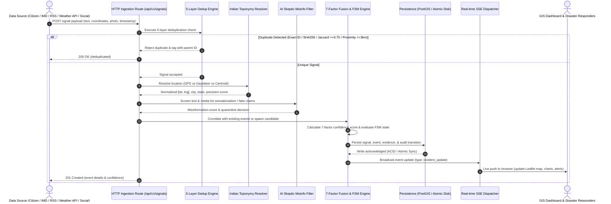

# N-WEIS End-to-End Data Flow Specification

**Document Version:** 1.0.0  
**Target:** Ministry of Earth Sciences / IMD — SIH26069  
**Scope:** Signal Ingestion, Deduplication, Verification, Fusion, Persistence, and Dissemination  

---

## 1. End-to-End Lifecycle Sequence Diagram

The following sequence illustrates the exact execution path when a new meteorological observation enters N-WEIS:



---

## 2. Detailed Data Transformation Stages

### Stage 1: Ingestion & Schema Normalization
A raw payload is received via:
- `POST /api/v1/signals` (generic automated ingestion)
- `POST /api/v1/citizen-reports` (crowdsourced public reporting)
- `POST /api/v1/public-datasets/ingest` (bulk historical/telemetry datasets)
- Automated connector polling (Open-Meteo AWS, Google News RSS, IMD Bulletins)

**Normalized Signal Schema:**
```json
{
  "id": "sig_1725773940123_abcde",
  "source_type": "citizen | imd | weather_api | news | social_media | public_dataset",
  "source_name": "String (identifying author or telemetry station)",
  "external_id": "String or null",
  "text": "Full observational report string",
  "latitude": 26.1750,
  "longitude": 91.7780,
  "city": "Guwahati",
  "state": "Assam",
  "location_confidence": 0.98,
  "location_method": "native_gps | geo_reasoning | geocoder_fallback",
  "media_urls": ["https://..."],
  "hashtags": ["#flood", "#imd"],
  "timestamp": "ISO-8601 UTC"
}
```

### Stage 2: Deduplication Gates (5 Layers)
Every accepted signal passes through 5 sequential filtering gates:
1. **Gate 1 (Exact ID):** Matches external unique IDs provided by APIs or social platforms.
2. **Gate 2 (SHA-256 Content Hash):** Normalized lowercase trimmed text hash.
3. **Gate 3 (Jaccard Semantic Token Similarity):**
   $$J(A, B) = \frac{|A \cap B|}{|A \cup B|} \ge 0.75$$
4. **Gate 4 (Media Checksum):** Matches previously processed photo URLs or checksums.
5. **Gate 5 (Spatiotemporal Proximity):** Haversine distance $\le 3.0$ km with matching event candidate and word token overlap $\ge 0.40$.

### Stage 3: Geocoding & Indian Toponymy Resolver
Resolves location through a 3-tier hierarchy:
- **Tier 1 (Native GPS):** Checks coordinate validity within Indian territorial bounding box ($6.5^\circ \text{N} \le \text{Lat} \le 37.5^\circ \text{N}$, $68.0^\circ \text{E} \le \text{Lng} \le 97.5^\circ \text{E}$). Confidence = $0.98$.
- **Tier 2 (Gazetteer & Landmark Reasoning):** Matches city names and prominent localized aliases (e.g. *Jalukbari*, *Maligaon* $\to$ Guwahati, Assam; *Marathahalli*, *Bellandur* $\to$ Bengaluru, Karnataka; *Connaught Place*, *Safdarjung* $\to$ New Delhi). Confidence = $0.90$.
- **Tier 3 (Centroid Fallback):** National Met Centre centroid fallback with degraded confidence = $0.25$.

### Stage 4: AI Skeptic Misinformation Filter
Evaluates signals for sensationalism, hoax claims, or recycled images:
- **Lexical Pattern Check:** Flags clickbait tokens (*"IMD hiding truth"*, *"apocalypse"*, *"unprecedented tsunami in Delhi"*).
- **Recycled Media Check:** Matches photos against an in-memory registry of debunked disaster hoaxes.
- **Action:** If misinfo score $> 0.50$, signal is tagged `REJECTED`, quarantined from event confidence fusion, and logged in the immutable verification audit trail.

### Stage 5: Confidence Fusion & Incident Formation
Signals are matched against existing active events within a spatial radius ($r = 15$ km for urban storms, $r = 30$ km for riverine floods). 
If an existing event matches:
- The signal is appended to the event's evidence registry (`memEvidence` and `event_evidence` table).
- Event boundaries and centroid are recalculated.
- 7-Factor Confidence is recomputed.
- If confidence crosses $0.80$, event status is promoted to `VERIFIED`.
If no event matches, a new event candidate is initialized with status `DETECTED`.

### Stage 6: Persistence
The updated state is synchronously written:
1. When `DATABASE_URL` is set: executes parameterized SQL statements against PostgreSQL and PostGIS tables.
2. In standalone mode: updates `db.tables` and executes atomic disk sync to `data/nweis-store.json` using temporary write + file rename to eliminate corruption risk.

### Stage 7: Real-Time Multi-Channel Dissemination
- **SSE Stream:** Pushes `incident_update` payload to all active browser sessions (`/api/v1/events/stream`).
- **GIS Dashboard:** Updates Leaflet markers, radar pulsing circles, telemetry charts, and system status counters.
- **CAP Broadcast Engine:** Generates OASIS CAP v1.2 XML for cellular towers and state emergency management portals.
- **First Responder Dispatch:** Emits 160-character cellular SMS alerts to SDRF battalions and Aapda Mitra volunteers.
