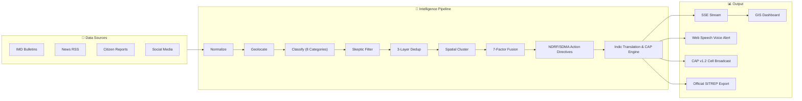

# N-WEIS Walkthrough — SIH 2026

> **National Weather Event Intelligence System**
> Problem Statement SIH26069 | Ministry of Earth Sciences / IMD

---

## System Overview

N-WEIS is a zero-dependency, real-time AI-powered weather intelligence platform that collects fragmented weather signals from multiple sources, verifies them through a multi-layer pipeline, and produces high-confidence geolocated weather events with full explainability.



---

## What Was Built

### Core Backend — `server-nweis.mjs` (~1250 lines)

| Feature | Details |
|---------|---------|
| **Multi-Source Ingestion** | IMD, News, Social Media, Citizen Reports — all normalized to unified signal schema |
| **4-Tier Geolocation** | GPS → Landmark/Alias → City Gazetteer → Centroid Fallback |
| **8-Category Classifier** | FLOOD, THUNDERSTORM, RAINFALL, HEATWAVE, FOG, DUST_STORM, STRONG_WIND, OTHER |
| **Skeptic Agent** | Detects sensationalism, recycled media, and hoaxes; quarantines to REJECTED |
| **3-Layer Deduplication** | Layer 1: Exact ID, Layer 2: Jaccard ≥ 0.75, Layer 3: ≤ 3.0 km proximity |
| **7-Factor Confidence Fusion** | Source reliability, AI relevance, media, spatial, temporal, corroboration, IMD synergy |
| **Temporal Confidence Decay** | Hazard-specific half-lives with formula: `confidence × 0.5^(Δt / halfLife)` |
| **State Machine Lifecycle** | DETECTED → UNDER_REVIEW → VERIFIED → RESOLVED with immutable audit trail |
| **Official Sensor Alignment** | CWC River Gauges, IMD AWS, Doppler Radar, Anemometers, Tide Gauges, RVR |
| **Operational Directives Engine** | Synthesizes domain-calibrated emergency orders for NDRF, CWC, NHAI, ATC, and SDMA |
| **Multilingual Indic Engine** | Generates localized public alerts in 6 languages: English, Hindi, Assamese, Bengali, Marathi, and Kannada |
| **OASIS CAP v1.2 Alert Standard** | Generates ITU-T X.1303 compliant XML/JSON emergency alert payloads with 15km geofencing circles |
| **Cell Broadcast Simulator** | Simulates multi-tower cellular emergency alert dispatches with population reach analytics |
| **Official NDMA/IMD SITREP** | Generates standardized Situation Reports with digital tamper seal & full evidence dossier |
| **SSE Real-Time Push** | Sub-second Server-Sent Events to all connected dashboard clients |
| **Static Dashboard Serving** | Serves `public/index.html` for browser access at root |

### GIS Dashboard — `public/index.html` (~1350 lines)

- **Dark-mode Leaflet Map**: Centered on India with CartoDB Dark Matter tiles.
- **Dynamic Quick-Bar**: 1-click execution for `🇮🇳 All India (7 Regions)`, 7 regional scenarios, and `⏩ Simulate 2h Decay`.
- **Enhanced Event Cards**: Sidebar cards render active sensor badges (e.g. `📡 Doppler Radar: 52 dBZ`), temporal decay freshness score, and half-life.
- **Intelligence Drawer**:
  - 7-Factor Confidence Gauge + 4-Way Source Matrix (IMD/News/Citizen/Social).
  - Evidence Freshness progress bar with automatic color degradation.
  - Sensor Telemetry Panel with station thresholds and exceedance alerts.
  - Explainable AI Narrative detailing the exact mathematical fusion basis.
  - Automated Operational Directives (NDRF / SDMA) for rapid emergency response.
  - **Multilingual Voice Warning & Regional Language Advisory**: Interactive language selector with in-browser Web Speech API audio alert broadcast.
  - **Cell Broadcast (CAP) Simulator**: Displays simulated emergency mobile alert banner and raw RFC 4946 / OASIS CAP v1.2 XML payload.
  - Complete Corroborating Evidence Dossier with media thumbnails.
  - State Machine Lifecycle Audit Trail with immutable timestamps.
- **Interactive SITREP Modal**: Direct in-browser viewing, print layout, and JSON download of official IMD Disaster Situation Reports.
- **Citizen Report Modal Form**: Direct ground report ingestion with GPS geolocation.

### Docker Containerization

| File | Purpose |
|------|---------|
| `Dockerfile` | `node:20-alpine`, non-root user, healthcheck, zero-dependency |
| `.dockerignore` | Excludes node_modules, .git, apps/, specs/, test files |
| `docker-compose.yml` | `nweis` service on port 3001 with `restart: unless-stopped` |

---

## 8 Demo Scenarios (Including All India Overview)

| # | Scenario | City, State | Hazard | Confidence | Key Sensors | Local Lang |
|---|----------|------------|--------|------------|-------------|------------|
| 0 | **All India Overview** | 7 Regions (Nationwide) | `MULTI-HAZARD` | Up to 94% | Nationwide sensor network alignment | All 6 Languages |
| 1 | **Guwahati Flood** | Guwahati, Assam | FLOOD | 94% | CWC Brahmaputra Pandu, IMD Borjhar AWS | অসমীয়া (Assamese) |
| 2 | **Delhi Thunderstorm** | New Delhi, Delhi | THUNDERSTORM | 89% | IMD Palam DWR, IMD Safdarjung Anemometer | हिंदी (Hindi) |
| 3 | **Mumbai Rainfall** | Mumbai, Maharashtra | RAINFALL | 85% | Mumbai Port Tide Gauge, IMD Santacruz AWS | मराठी (Marathi) |
| 4 | **Rajasthan Heatwave** | Jaipur, Rajasthan | HEATWAVE | 92% | IMD Churu Synoptic AWS, IMD Bikaner Observatory | हिंदी (Hindi) |
| 5 | **Kolkata Cyclone Remal** | Kolkata, West Bengal | THUNDERSTORM | 81% | IMD Alipore Anemometer, Diamond Harbour Tide Gauge | বাংলা (Bengali) |
| 6 | **Bengaluru Cloudburst** | Bengaluru, Karnataka | RAINFALL | 81% | IMD Bengaluru DWR, BBMP Bellandur Lake Gauge | ಕನ್ನಡ (Kannada) |
| 7 | **Delhi Dense Fog** | New Delhi, Delhi | FOG | 87% | IGI Airport RVR, IMD Safdarjung Observatory | हिंदी (Hindi) |

---

## API Endpoints

| Endpoint | Method | Description |
|----------|--------|-------------|
| `/health` | GET | System healthcheck |
| `/api/v1/events/stream` | GET | SSE real-time event stream |
| `/api/v1/events` | GET | List events (filterable by type, state, status, min_confidence) |
| `/api/v1/events/:id` | GET | Event detail with evidence + lifecycle audit |
| `/api/v1/events/:id/sitrep` | GET | Export official IMD/NDMA Situation Report (SITREP) |
| `/api/v1/events/:id/bulletin` | GET | Localized Indic alert bulletin (English, Hindi, Assamese, Bengali, Marathi, Kannada) |
| `/api/v1/events/:id/cap` | GET | Export ITU-T X.1303 / OASIS CAP v1.2 standard XML or JSON early warning alert |
| `/api/v1/events/:id/broadcast-cap` | POST | Simulate Cell Broadcast Service (CBS) emergency alert transmission |
| `/api/v1/events/:id/dispatch-volunteers` | POST | Simulate GSM 7-bit SMS dispatch to localized SDRF units and Aapda Mitra volunteers |
| `/api/v1/signals` | POST | Ingest raw signal |
| `/api/v1/citizen/reports` | POST | Submit citizen weather report |
| `/api/v1/admin/demo/scenario/:id` | POST | Trigger demo scenario (or `national-overview`) |
| `/api/v1/admin/demo/simulate-time` | POST | Simulate temporal decay |
| `/api/v1/admin/stats` | GET | System KPIs and analytics |

---

## Test Results — 64/64 Passing (100%)

```
TEST 1: Citizen Flood Report End-to-End Processing          (3 assertions)
TEST 2: Three Duplicate Social Posts (Deduplication Engine)  (2 assertions)
TEST 3: Skeptic / Misinformation Engine Flagging             (3 assertions)
TEST 4: Multi-Source Evidence Fusion (Guwahati 94%)          (3 assertions)
TEST 5: SIH 2026 8-Category Taxonomy Classification         (7 assertions)
TEST 6: Temporal Confidence Decay & Freshness Model          (5 assertions)
TEST 7: State Machine Lifecycle Audit Trail & Invariants     (4 assertions)
TEST 8: Expanded Geographical Coverage (Kolkata/BLR/Fog)     (11 assertions)
TEST 9: Operational Directives & Official SITREP Generation   (8 assertions)
TEST 10: Multilingual Localization & CAP v1.2 Alert Engine   (10 assertions)
TEST 11: Emergency Volunteer & SDRF SMS Dispatch Engine      (8 assertions)
────────────────────────────────────────────────────────────────
TOTAL: 64/64 Tests Passed (100% Success across 11 Test Suites)
```

---

## Quick Start

```bash
# Zero dependency — no npm install needed!
node server-nweis.mjs

# Open Dashboard in Browser
# http://localhost:3001

# Run Automated Test Suite
node test-nweis.mjs

# Docker Container
docker build -t nweis .
docker run -p 3001:3001 nweis
```

---

## 5-Minute Judge Demo Playbook

1. **Start System** → `node server-nweis.mjs` → Open `http://localhost:3001`
2. **National Picture** → Click **"🇮🇳 All India (7 Regions)"** → Observe simultaneous population of events across 7 regions of India.
3. **Inspect Event & Ground Truth** → Click **"Guwahati Flood"** card → Observe 94% confidence, CWC Brahmaputra River Gauge at 50.12m (above 49.68m danger mark), and 4-way corroboration.
4. **Multilingual Alert & Audio** → In drawer, switch language dropdown to **"অসমীয়া (Assamese)"** or **"हिंदी (Hindi)"** → Click **"🔊 Play Audio Alert"** to hear browser voice synthesis.
5. **Cell Broadcast (CAP)** → Click **"🚨 Cell Broadcast (CAP)"** → Show mobile emergency warning banner and OASIS CAP v1.2 XML payload.
6. **Action Directives** → Show NDRF water rescue deployments and CWC alerts.
7. **Export SITREP** → Click **"Generate & Export IMD/NDMA SITREP"** → Show formal government Disaster Situation Report modal with digital seal.
8. **Temporal Decay Engine** → Click **"⏩ Simulate 2h Decay"** → Watch freshness bars drain and confidence scores mathematically decay.
9. **Citizen Ground Reinforcement** → Click **"Citizen Report"** button → Submit report for Guwahati → Watch confidence immediately restore to 94% with fresh audit trail entry.
